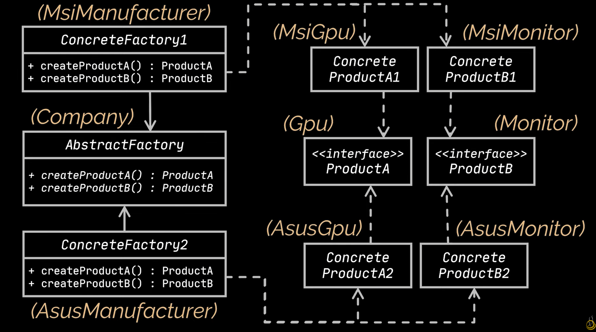
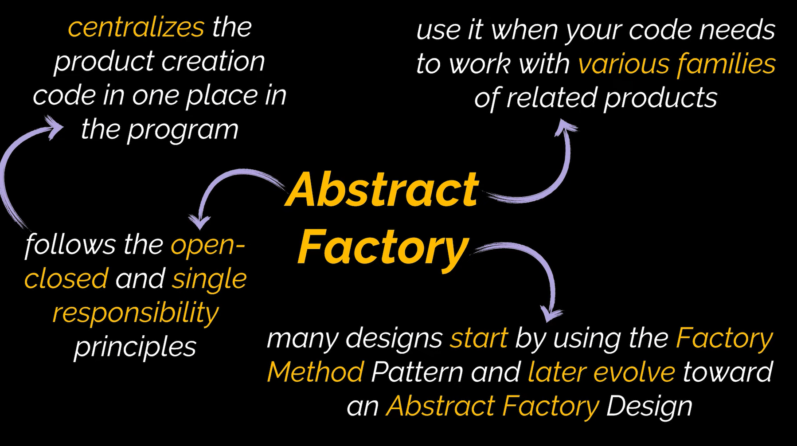

# Abstract Factory Design Pattern

The abstract factory design pattern is a creational design pattern. It enhances the factory design pattern by multiplying the factory classes and linking them at a higher level with an abstract factory class.

In essence, it works similarly to the factory design pattern. However, by introducing more intervening interfaces between superclasses and their instances, it further enhances the system’s ability to branch into new areas.

# Diagram

# When To Use

