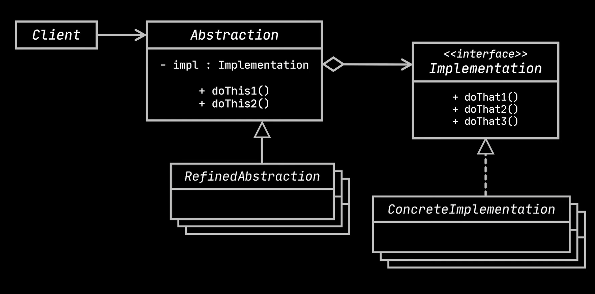
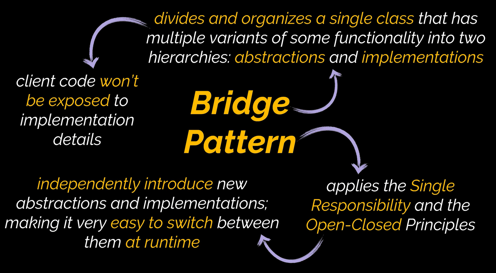

# Bridge Design Pattern

The Bridge design pattern is a structural design pattern. It’s a hierarchy breaker. It splits the large and complex hierarchy into two, which can then be developed independently from each other.

# Uml Diagram

# When To Use

