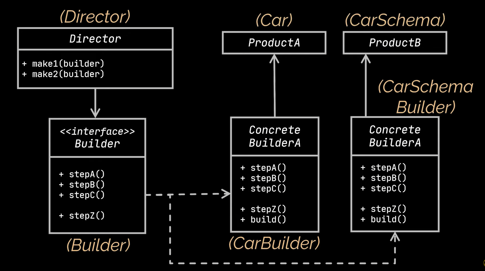
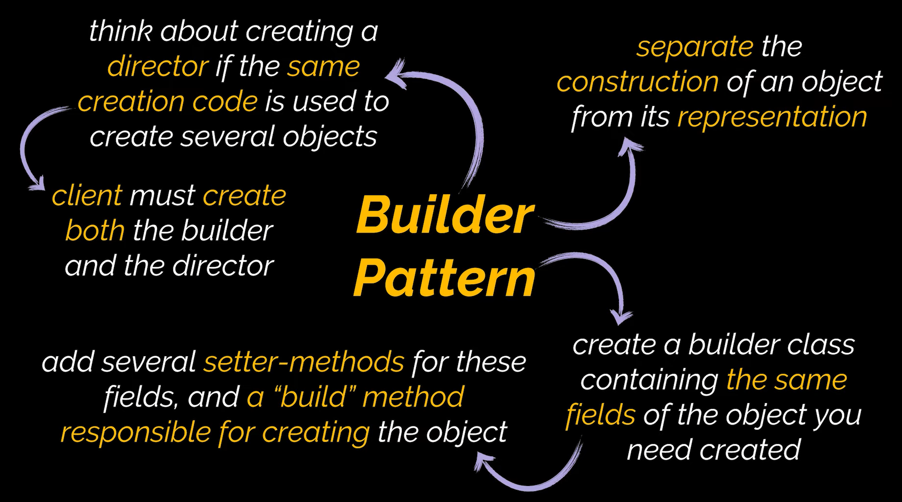

# Builder Design Pattern

The Builder design pattern is a creational design pattern. It works in the construction of complex objects by breaking the construction process into steps. It allows manipulation and alteration of object construction steps. With the Builder design pattern, various types of objects can be produced using the same construction system.

# Diagram

# When To Use

