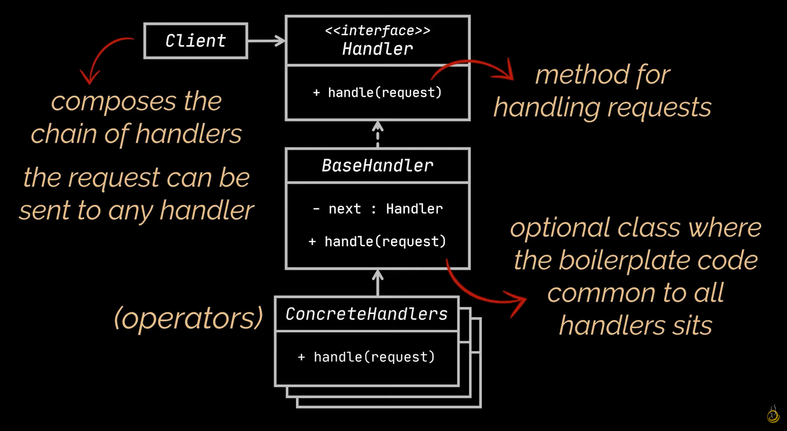
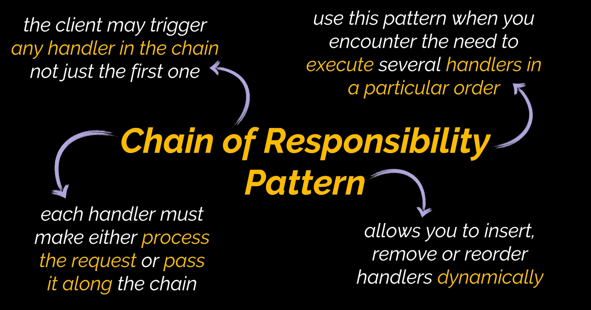

# Chain Of Responsibility Design Pattern

The Chain of Responsibility design pattern is a behavioral design pattern. It processes requests within a chain of handler objects, deciding whether to pass or deny the requests.

# Uml Diagram

# When To Use

