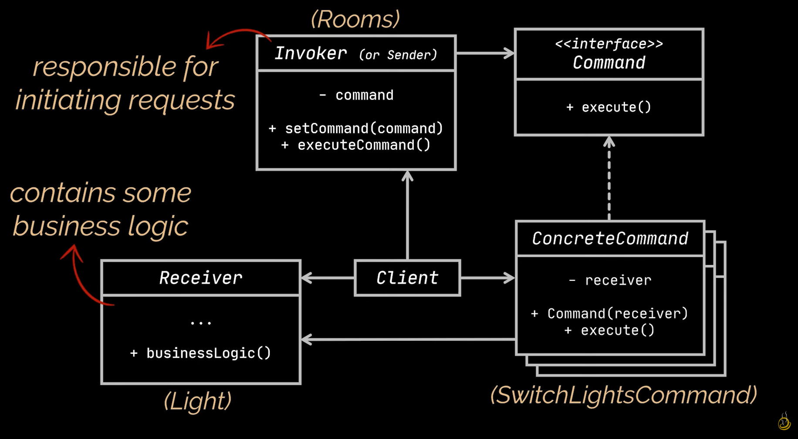
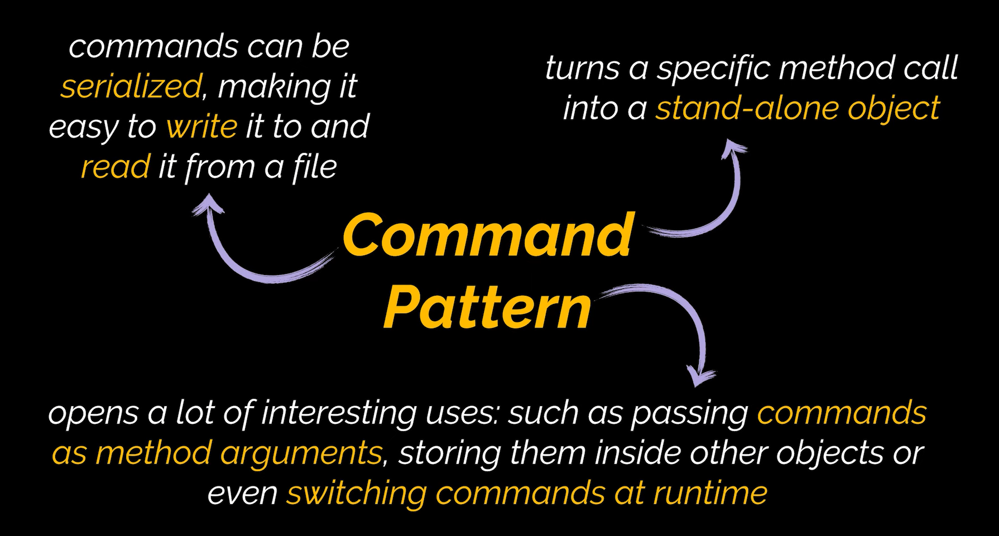

# Command Design Pattern

The command design pattern is a behavioral design pattern. It provides the ability to turn complicated objects or requests into standalone objects that contain all the related information. With this transformation, a request’s execution can be altered or delayed based on needs.
# Diagram

# When To Use

