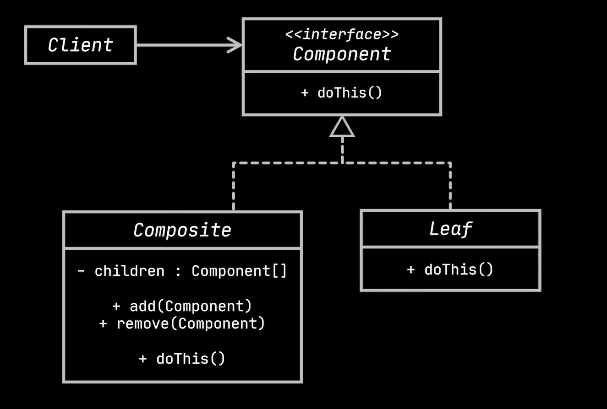
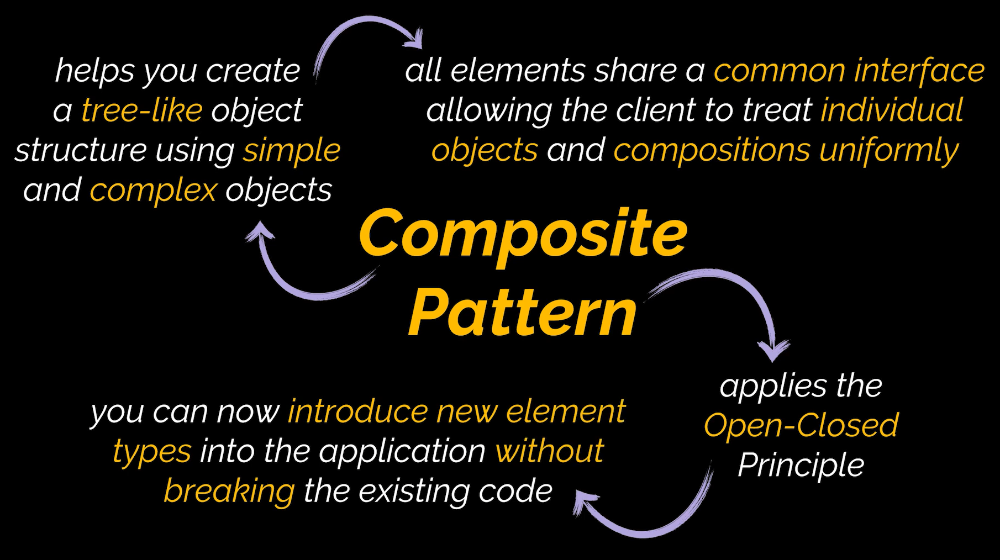

# Composite Design Pattern

The composite design pattern is a structural design pattern also known as the object tree design pattern. It composes objects to form a tree structure and provides the ability to use individual objects within the tree structure.

# Uml Diagram

# When To Use

