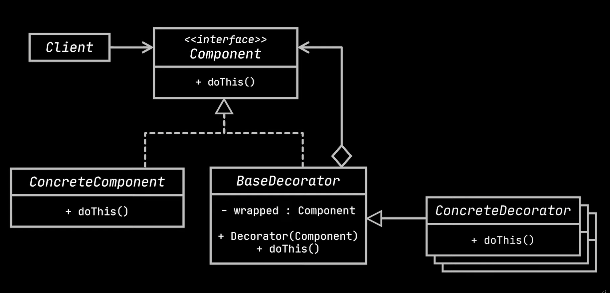
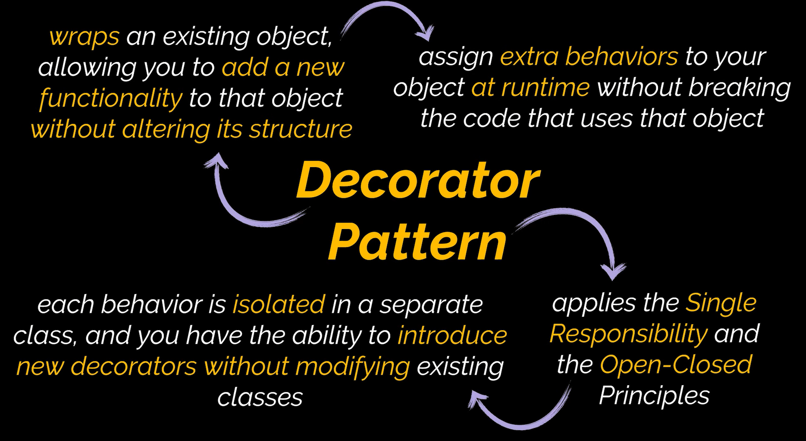

# Decorator Design Pattern

The decorator is a structural design pattern that provides the ability to attach new responsibilities to objects. It places the objects into a special wrapper, and by using this wrapper, it adds new responsibilities.

# Diagram

# When To Use

