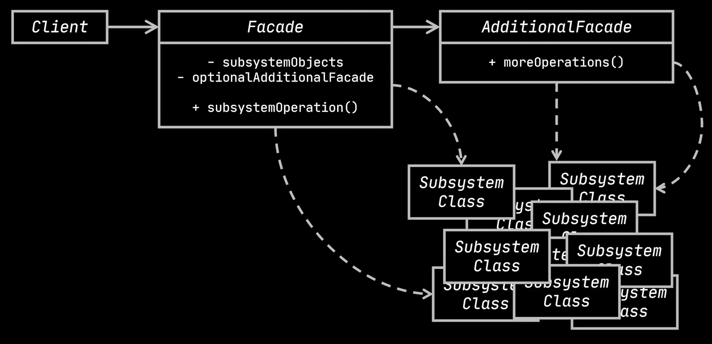
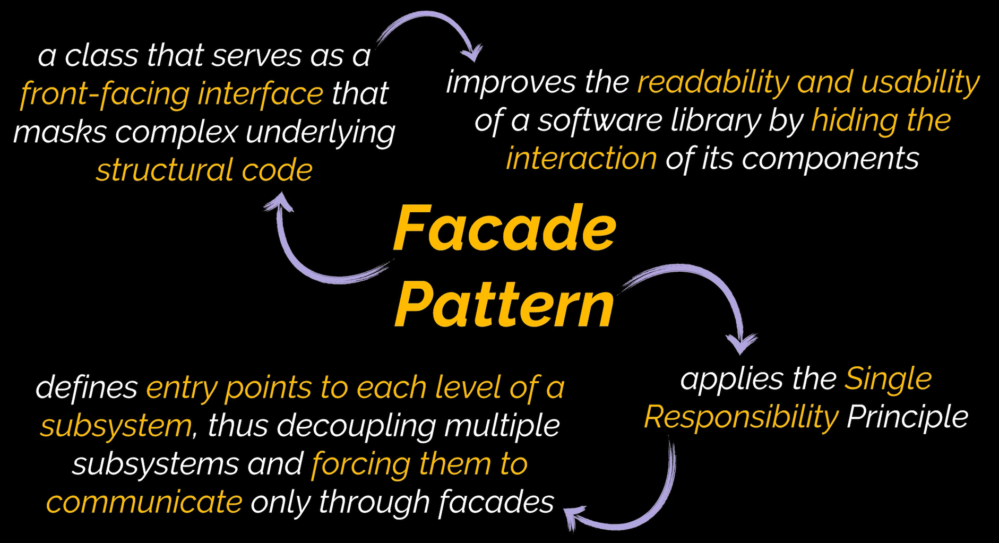

# Facade Design Pattern

The Facade design pattern is a structural design pattern. It provides a simplified uniform interface for complex libraries or frameworks. By offering this uniform interface, it limits the properties exposed in the subclasses, presenting only the necessary properties to the client.

# Diagram

# When To Use

