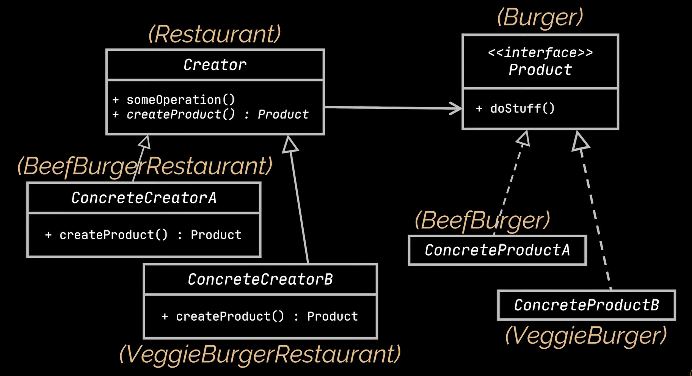
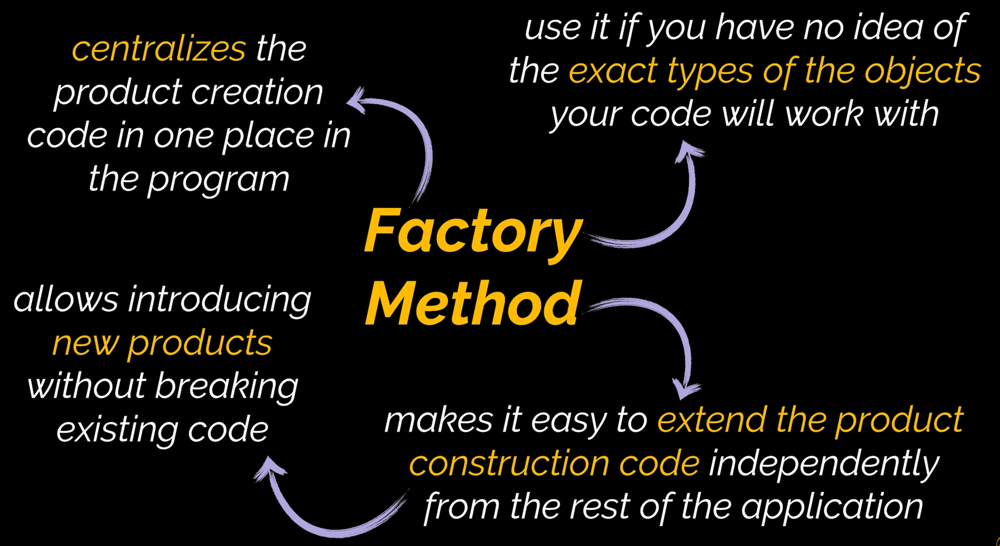

# Factory Design Pattern

The Factory Design Pattern is a creational design pattern that manipulates the creation of objects from superclasses. It places an interface between the superclass and its instances. This approach provides the option to manipulate the superclass instance. With the aid of this interface, we can change and alter the type of instance that is going to be created. This way, we can have various types of instances based on our requirements.

# Uml Diagram

# When To Use

