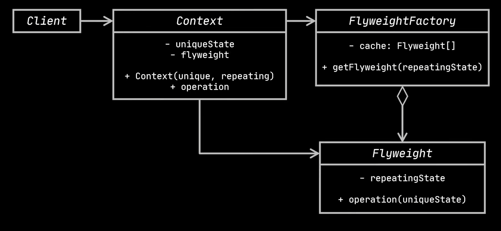
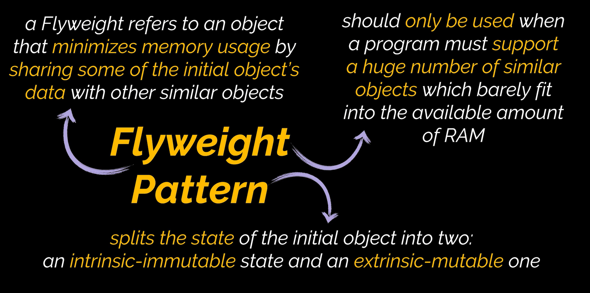

# Flyweight Design Pattern

The Flyweight design pattern is a structural design pattern. It provides the ability to manipulate data across RAM. With this design pattern, the amount of space that objects occupy in the RAM can be altered by separating the common parts of the objects across all objects.

# Diagram

# When To Use

