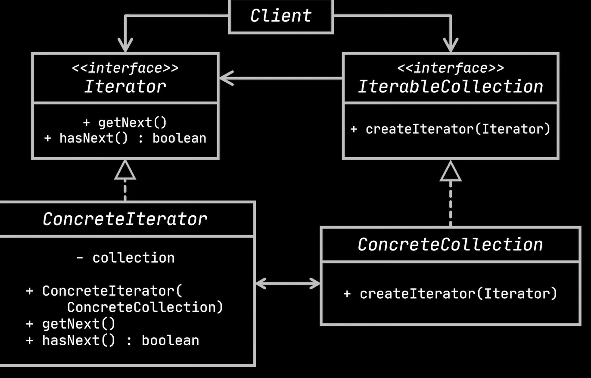
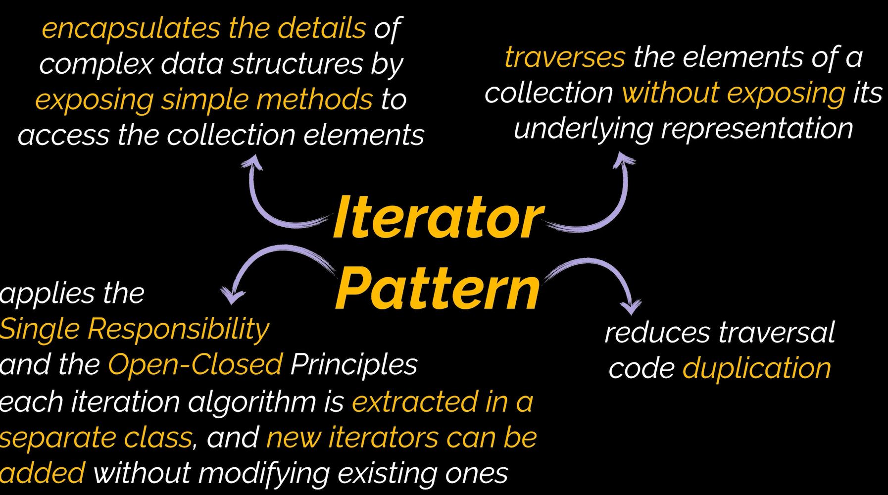

# Iterator Design Pattern

The iterator design pattern is a behavioral design pattern. It provides the ability to traverse through objects without delving into the objects’ inner structure or their underlying dependencies.

# Uml Diagram

# When To Use

