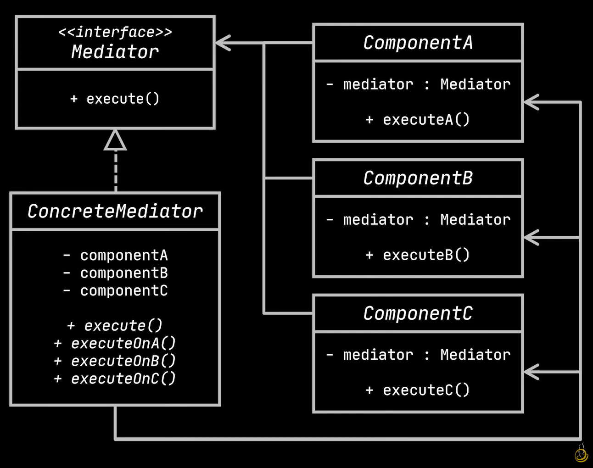
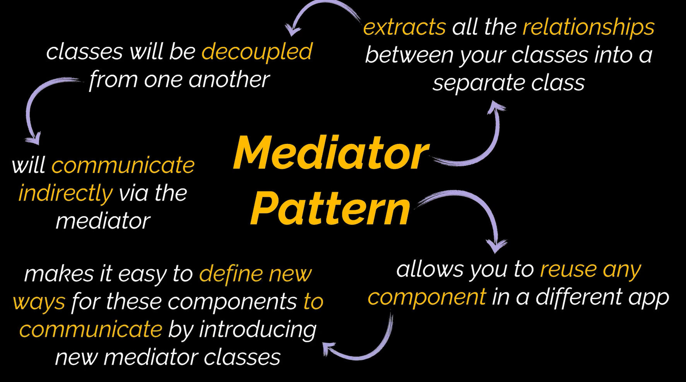

# Mediator Design Pattern

The mediator design pattern is a behavioral design pattern. It provides the ability to reduce complicated dependencies between objects. It achieves this by introducing a mediator object placed in the middle of communication between objects, thereby restricting objects from forming direct dependencies between them.

# Uml Diagram

# When To Use

