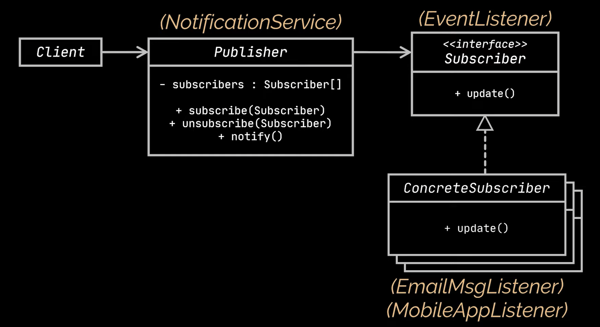
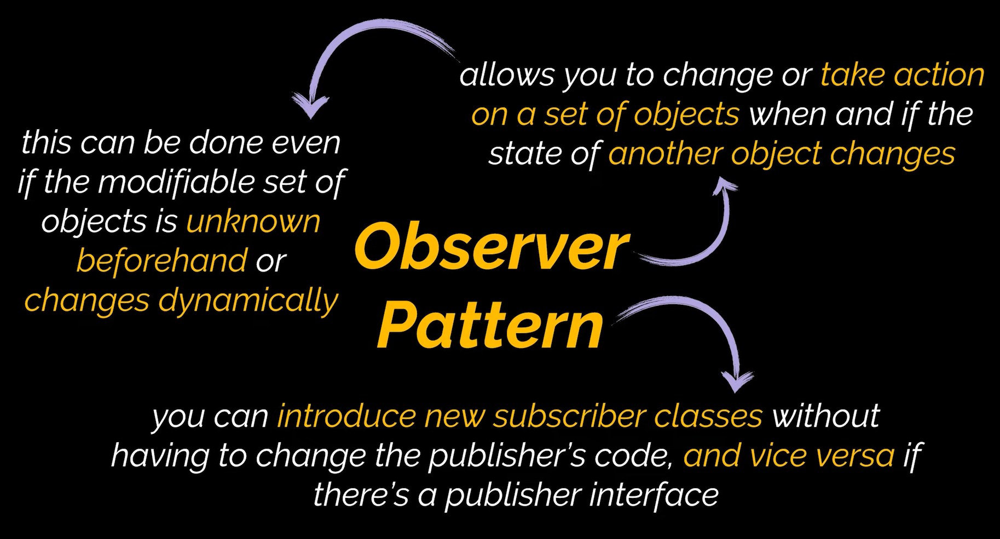

# Observer Design Pattern

The observer design pattern is a behavioral design pattern that provides the ability to build a subscription mechanism for objects. With this mechanism, the system gains the ability to observe the objects’ life cycle.

# Uml Diagram

# When To Use

