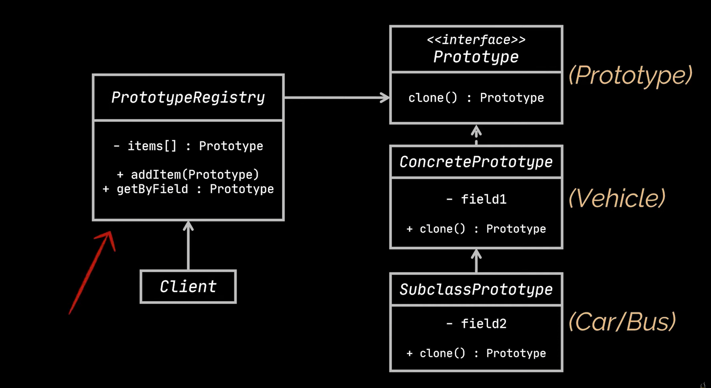
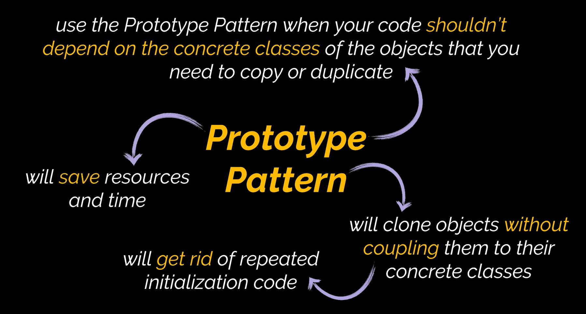

# Prototype Design Pattern

The Prototype design pattern is a creational design pattern. It provides the ability to clone objects without rebuilding them from scratch. With the prototype design pattern, the cloned objects do not form dependencies with the original objects’ relationships.

# Uml Diagram

# When To Use

