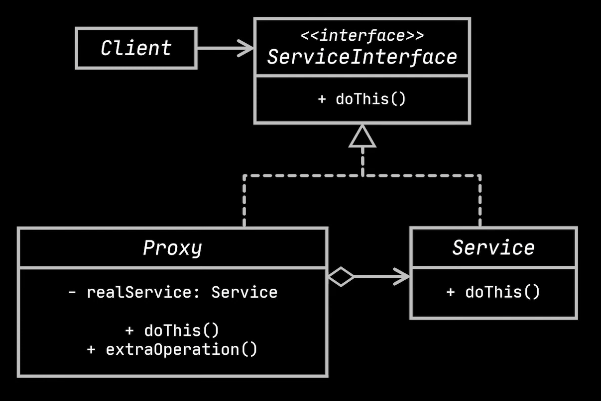
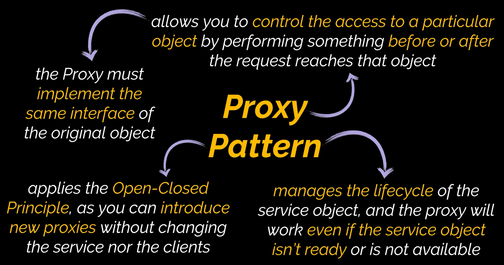

# Proxy Design Pattern

The proxy design pattern, classified as a structural design pattern, serves as an intermediary within a system. With the proxy design pattern, the communication between objects can be performed through third-party intermediate objects. Using these proxy objects, the actions of the system can be controlled and altered before or after the request from the client reaches the objects.

# Uml Diagram

# When To Use

