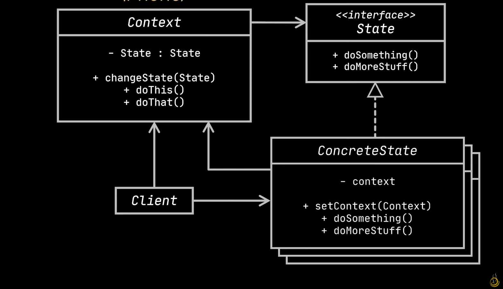

# State Design Pattern

The state design pattern is a behavioral design pattern that provides the ability to alter the internal state of objects in case of changes, as if the object changed its class.

# Uml Diagram

# When To Use

