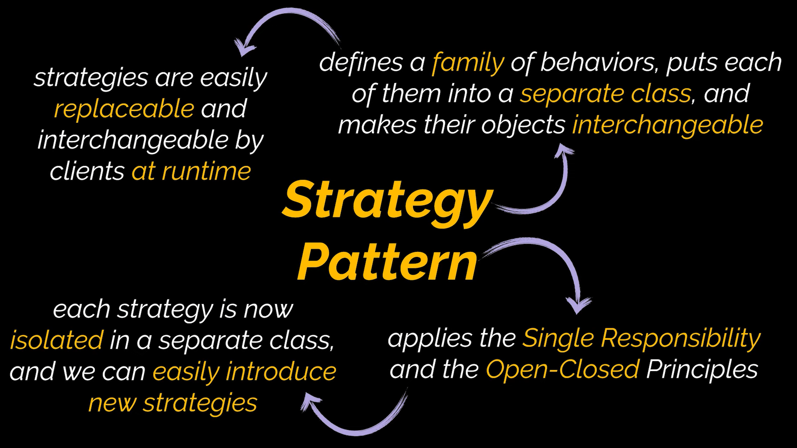

# Strategy Design Pattern

The strategy design pattern is a behavioral design pattern. It provides the ability to desing multiple algoritm in seperate classes form a interchangeable structure.

# Uml Diagram

# When To Use

