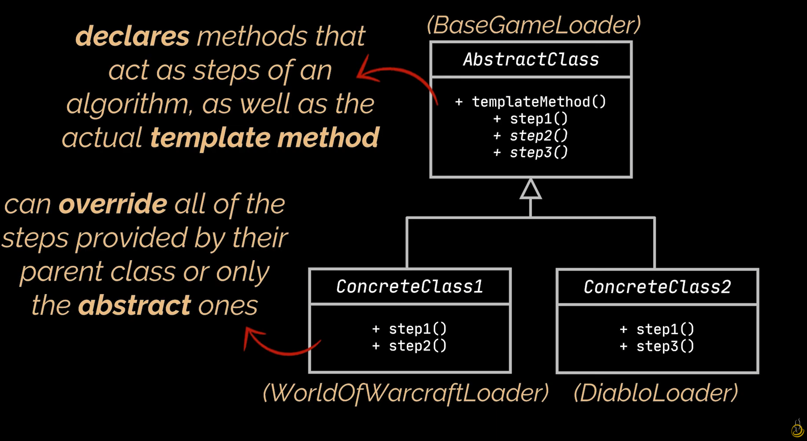
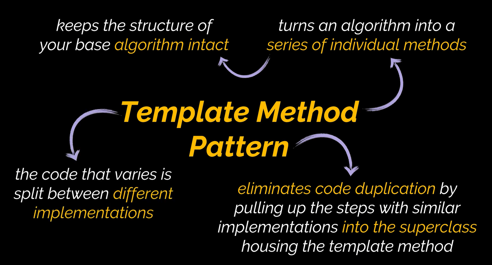

# Prototype Design Pattern

The template method design pattern is a behavioral design pattern. It provides the ability to split and change the algortihms workings by using super class to outline the algoritihms and lower classes to change and alter the steps of the algorithm.

# Uml Diagram

# When To Use

