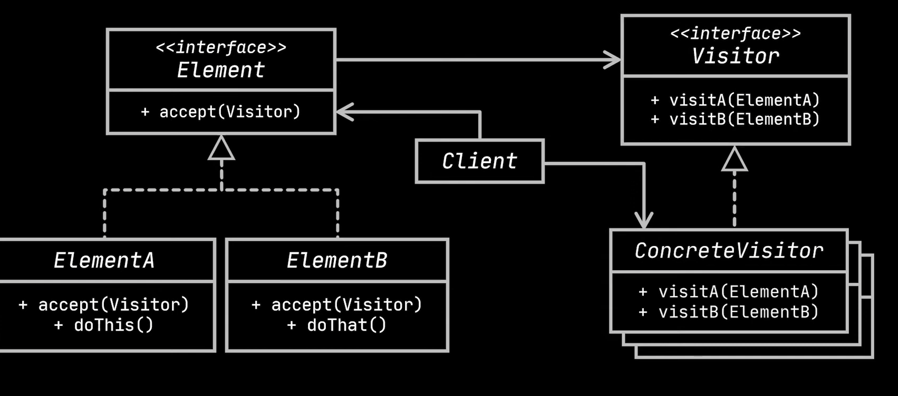
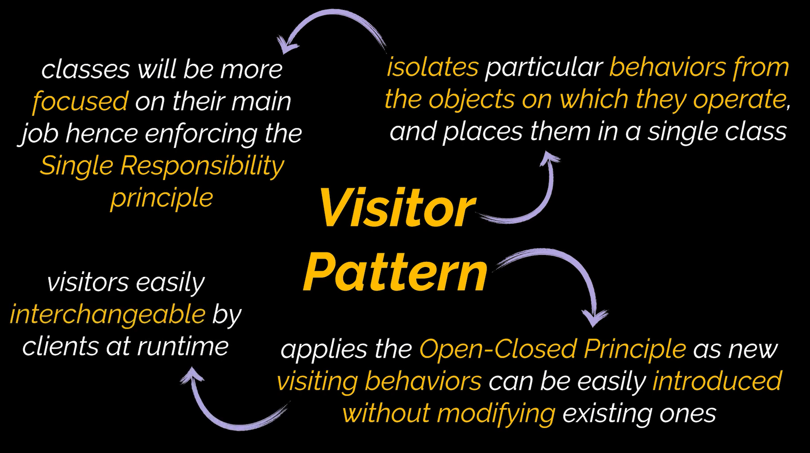

# Visitor Design Pattern

The visitor design pattern is a behavioral design pattern that provides the ability to separate algorithms from the objects they are working on.

# Uml Diagram

# When To Use

